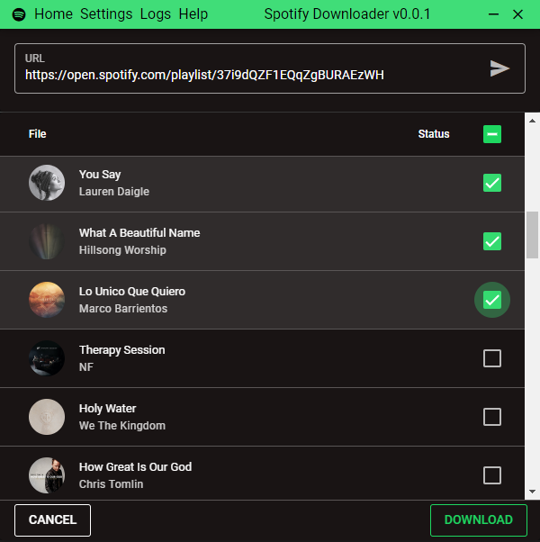
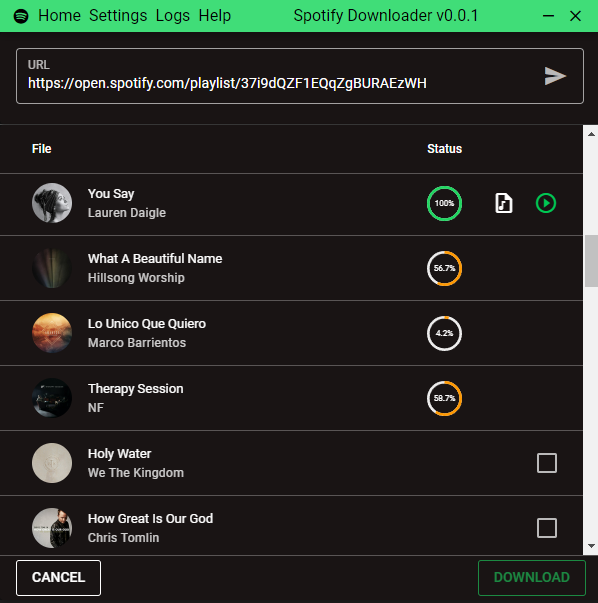

# Spotify Downloader

SpotifyDownloader is a simple Desktop Application to download Spotify playlists and songs using YouTube with album art and metadata

## Download

- **[Stable release](https://github.com/JacksonBelizario/SpotifyDownloader/releases/latest)**

## Screenshots




## Notes

- App made with [Electron](https://www.electronjs.org/), based on commandline utility [spotifydl](https://github.com/SwapnilSoni1999/spotify-dl).
- No need to configure or install external programs, such as [FFMPEG](https://ffmpeg.org/download.html), as it is already included via [@ffmpeg-installer/ffmpeg](https://www.npmjs.com/package/@ffmpeg-installer/ffmpeg).

## Compiling Project

- ### Install the dependencies

```bash
yarn
# or
npm install
```

- #### Start the app in development mode (hot-code reloading, error reporting, etc.)

```bash
yarn dev
# or
npm run dev
```

- #### Lint the files

```bash
yarn lint
# or
npm run lint
```

- #### Format the files

```bash
yarn format
# or
npm run format
```

- #### Build the app for production

```bash
yarn build
# or
npm run build
```
